# 🔥 Brasa Viva

Aplicación móvil para la gestión integral de un restaurante — Trabajo Final Integrador, Tecnicatura Universitaria en Programación (UTN Avellaneda), 2026.

Repositorio: `brasaviva-2026`

---

## 👥 Integrantes del equipo 

| Apellido y Nombre | Usuario GitHub | 
|---|---|
| Wolf, Matias | [@MatiasWolf](https://github.com/MatiasWolf) |
| Moyano, Martín | [@MartinMoyano1](https://github.com/MartinMoyano1) |
| Miguel, Luján | [@Lujan-84](https://github.com/Lujan-84) |
| Torrez, Maximiliano | [@MxmlnST](https://github.com/MxmlnST) |

**Responsable de mantener este README actualizado:** Matias Wolf

---

## 🛠️ Stack tecnológico

- **Framework:** Ionic + Angular
- **Base de datos / Backend:** Supabase
- **Control de versiones:** Git / GitHub

---

## 🚀 Puesta en marcha

> **Requisito:** Node.js **22.22.3+** o **24.15.0+** (Angular CLI 22 no arranca con
> versiones anteriores). Verificar con `node -v` antes de instalar.

```bash
# Clonar el repositorio
git clone https://github.com/MatiasWolf/brasaviva-2026.git
cd brasaviva-2026

# Instalar dependencias
npm install

# Sincronizar el proyecto con Android Studio
npx cap sync android
npx cap open android

# Desde Android Studio, al conectar el celular mediante USB, vas a poder instalar la aplicación en tu celular

# Levantar en modo desarrollo
ionic serve
```

Las credenciales de Supabase ya están versionadas en `src/environments/environment.ts`
(desarrollo) y `src/environments/environment.prod.ts` (producción), así que no hay que
crear ningún archivo extra.

---

## 📁 Estructura del proyecto

```
src/
├── app/
│   ├── core/
│   │   ├── models/       # interfaces de dominio (Plato, Bebida, ...)
│   │   └── services/     # acceso a Supabase (auth, tablas, storage)
│   ├── shared/
│   │   └── components/   # componentes reutilizables (spinner-logo, ...)
│   ├── home/             # menú principal según el rol
│   ├── pages/            # una carpeta por punto funcional
│   ├── app.routes.ts     # cada punto agrega acá su ruta
│   └── app.component.ts
├── assets/               # íconos, splash e imágenes
├── environments/         # environment.ts (dev) y environment.prod.ts
└── global.scss           # estilos globales
```

> Cada punto funcional se desarrolla en su propia rama y crea su carpeta dentro
> de `src/app/pages/`. Lo que sea común a varios puntos va en `core/` o `shared/`.

---

## 🗂️ Índice de imágenes del proyecto

| Imagen | Descripción | Ruta |
|---|---|---|
|  | Logo en una tinta — usado en login, splash (estática y animada) y el spinner de carga, vía `<app-brand-logo variant="mono">` | `src/assets/brand/logo-mono.svg` |
|  | Logo a color completo — disponible en `BrandLogoComponent` (`variant="color"`), todavía no se usa en ninguna pantalla | `src/assets/brand/logo.svg` |
|  | Ícono de la app para el manifest PWA y "agregar a pantalla de inicio" | `src/assets/icons/icon-48.webp` … `icon-512.webp` |
|  | Logo fuente (transparente) para generar el splash nativo con `@capacitor/assets` | `resources/logo.png` |
|  | Capa de primer plano del ícono adaptativo de Android | `resources/icon_foreground.png` |
| 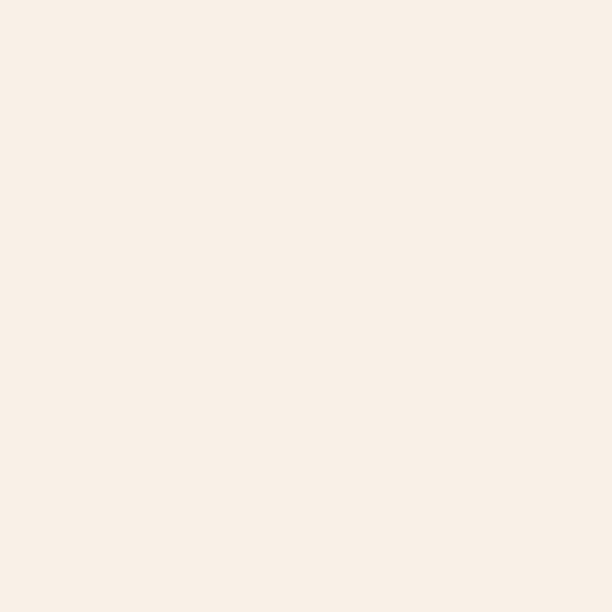 | Capa de fondo del ícono adaptativo de Android | `resources/icon_background.png` |

### Capturas de pantalla


<!-- o con tamaño controlado: -->
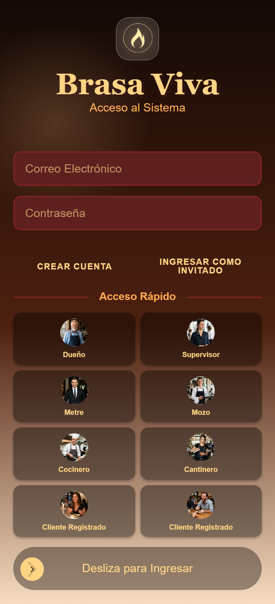
```

| Pantalla | Imagen | Ruta |
|---|---|---|
| Splash | 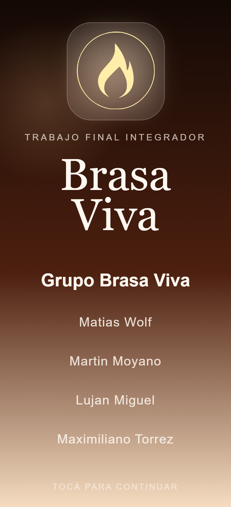 | `docs/capturas/splash.png` |
| Login |  | `docs/capturas/login.png` |
| Home (dueño / supervisor) | 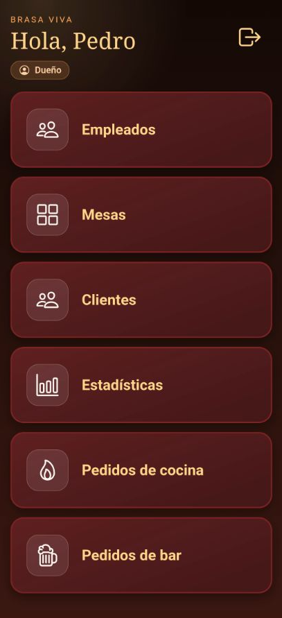 | `docs/capturas/principal.png` |
| Listado de empleados | 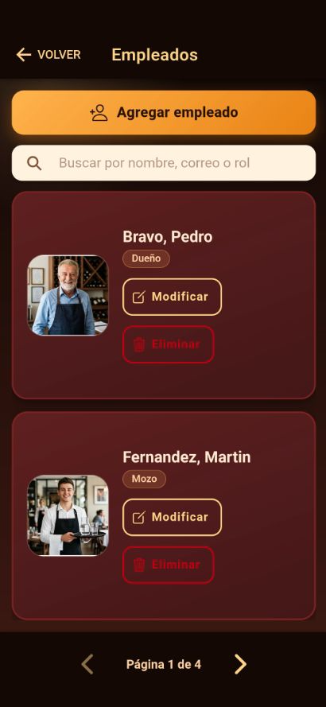 | `docs/capturas/empleados.png` |
| Alta de empleado | 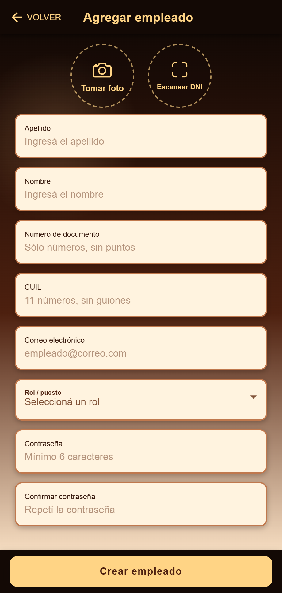 |`docs/capturas/alta-empleado.png` |
| Listado de mesas | 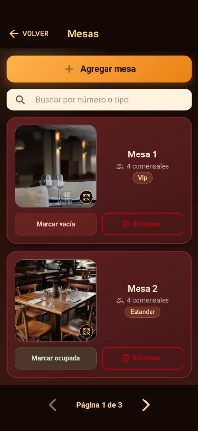 | `docs/capturas/mesas.png` |
| Alta de mesa | 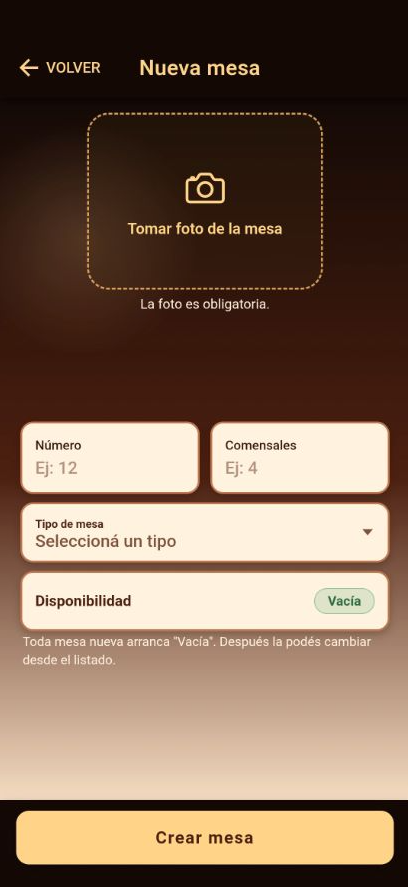 | `docs/capturas/alta-mesa.png` |
| Carta de platos | 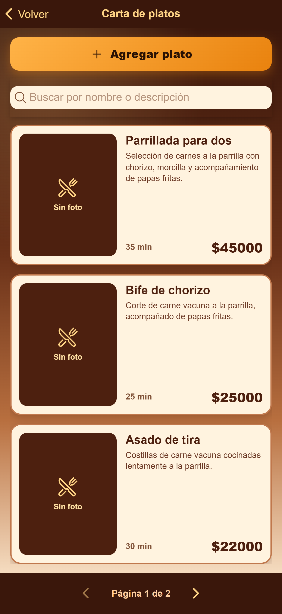 | `docs/capturas/platos.png` |
| Alta de platos | 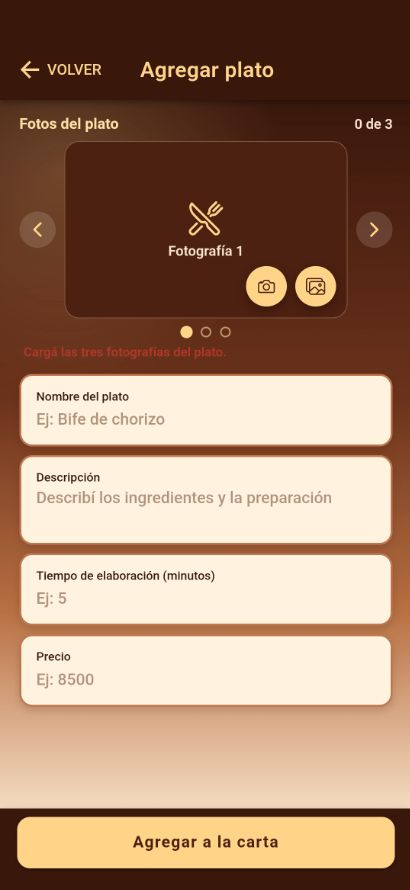 | `docs/capturas/alta-platos.png` |
| Carta de bebidas | 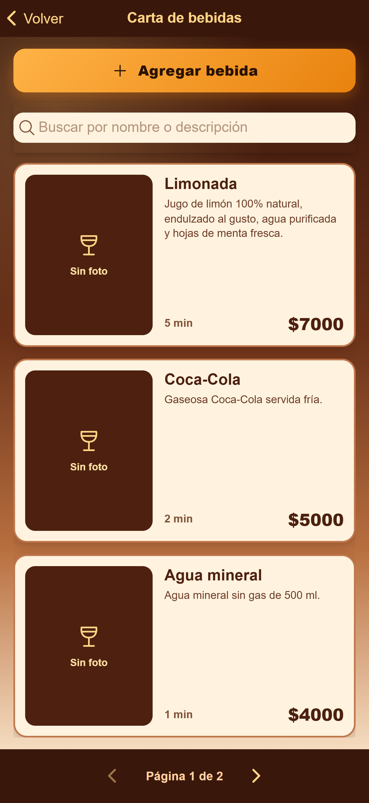 | `docs/capturas/bebidas.png` |
| Alta de bebidas | 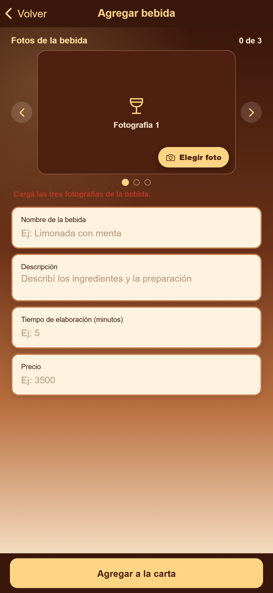 | `docs/capturas/alta-bebidas.png` |
| Registro de cliente | 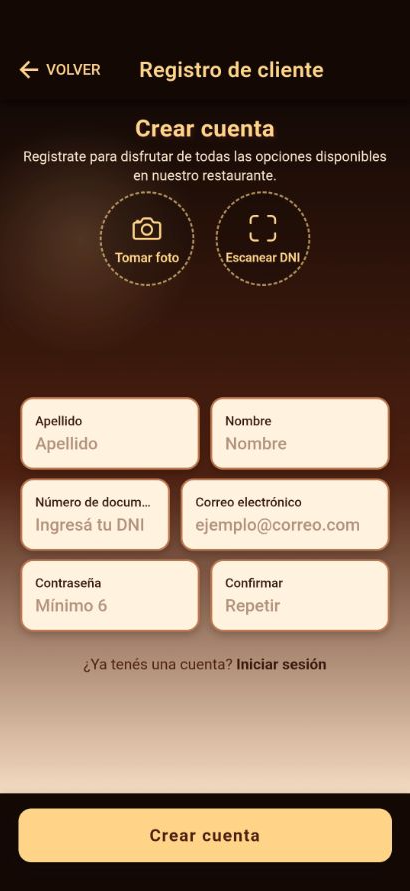 | `docs/capturas/registro-cliente.png` |
| Registro de cliente Anónimo | 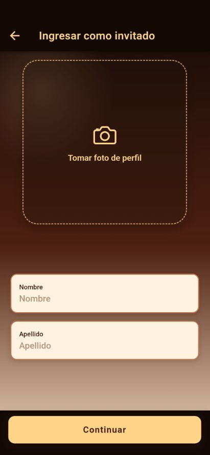 | `docs/capturas/registro-anonimo.png` |

---

## ✅ Estado de avance — Puntos funcionales

### Primera fecha (puntos 1 al 22)

| # | Funcionalidad | Responsable | Est. (días) | Inicio | Fin | Estado |
|---|---|---|---|---|---|---|
| 1 | Agregar empleado | Wolf, Matías | 2 | 01-09 | 03-09 | ✅ Completo |
| 2 | Agregar nuevo plato | Moyano, Martín | 2 | 01-09 | 03-09 | ✅ Completo |
| 3 | Agregar nueva bebida | Moyano, Martín | 1 | 03-09 | 03-09 | ✅ Completo |
| 4 | Agregar nueva mesa | Wolf, Matías | 2 | 04-09 | 06-09 | ✅ Completo |
| 5 | Crear cliente registrado | Miguel, Luján | 2 | 01-09 | 03-09 | ✅ Completo |
| 6 | Verificar ingreso de cliente | Wolf, Matías | 1,5 | 08-09 | 09-09 | ✅ Completo |
| 7 | Rechazar cliente | Wolf, Matías | 2 | 09-09 | 11-09 | ✅ Completo |
| 8 | Aceptar cliente | Wolf, Matías | 1 | 11-09 | 11-09 | ✅ Completo |
| 9 | Ingreso cliente anónimo | Miguel, Luján | 1 | 02-09 | 03-09 | ✅ Completo |
| 10 | Metre asigna mesa | Miguel, Luján | 1,5 | 07-09 | 08-09 | 🟨 En progreso |
| 11 | Ver menú + consulta al mozo | Torrez, Maximiliano | 3 | 08-09 | 11-09 | 🟨 En progreso |
| 12 | Cliente realiza pedido | Torrez, Maximiliano | 3 | aprox. 08-09 | 11-09 | 🟨 En progreso |
| 13 | Mozo rechaza pedido | Torrez, Maximiliano | 1 | 12-09 | 13-09 | ⬜ Pendiente |
| 14 | Mozo confirma pedido | Torrez, Maximiliano | 1,5 | 14-09 | 15-09 | ⬜ Pendiente |
| 15 | Juegos con descuento | Miguel, Luján | 4 | 12-09 | 16-09 | ⬜ Pendiente |
| 16 | Cocina recibe pedidos | Moyano, Martín | 1,5 | aprox. 08-09 | 09-09 | ⬜ Pendiente |
| 17 | Bar recibe pedidos | Moyano, Martín | 1 | 13-09 | 13-09 | ⬜ Pendiente |
| 18 | Aviso de pedido completo | Moyano, Martín | 1 | 14-09 | 15-09 | ⬜ Pendiente |
| 19 | Mozo entrega pedido | Torrez, Maximiliano | 1 | 16-09 | 17-09 | ⬜ Pendiente |
| 20 | Encuesta de satisfacción | Torrez, Maximiliano | 2,5 | 18-09 | 20-09 | ⬜ Pendiente |
| 21 | Cliente pide la cuenta | Torrez, Maximiliano | 2 | 21-09 | 23-09 | ⬜ Pendiente |
| 22 | Confirmar pago y liberar mesa | Torrez, Maximiliano | 1,5 | 24-09 | 25-09 | ⬜ Pendiente |

**Leyenda:** ⬜ Pendiente · 🟨 En progreso · ✅ Completo

### Ramas en curso

| # | Punto | Rama |
|---|---|---|
| 1 | Agregar empleado | `feature/agregar-empleado` |
| 2 | Agregar nuevo plato | `feature/agregar-plato` |
| 3 | Agregar nueva bebida | `feature/agregar-bebida` |
| 4 | Agregar nueva mesa | `integracion/primera-fecha` |
| 5 | Crear cliente registrado | `feature/registro-cliente` |
| 9 | Ingreso como cliente anónimo | `feature/registro-cliente-anonimo` |

---

## 🔑 Perfiles de usuario

- Dueño
- Supervisor
- Empleados: Metre / Mozo / Cocinero / Cantinero
- Cliente registrado
- Cliente anónimo

---

## 📲 Códigos QR utilizados

| QR | Función |
|---|---|
| Ingreso al local | Anunciarse en lista de espera / ver encuestas previas |
| Mesa | Ver info de mesa (staff) o acceder a menú, pedido, encuesta, juegos y pago (cliente) |
| Propina (x5) | Excelente 20% · Muy Bueno 15% · Bueno 10% · Regular 5% · Malo 0% |

---